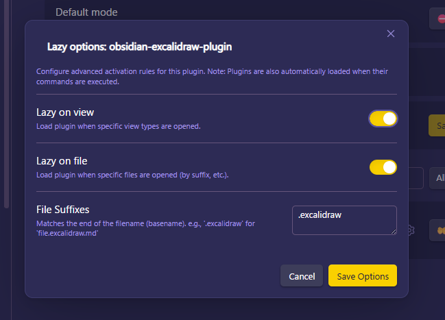

# 🦥 Lazy Loader

Lazy load plugins by caching their commands. Plugins are enabled on-demand when you trigger their commands (or open specific views), keeping startup fast.

**Important note #1**: After clicking **Apply changes**, Obsidian will restart once to apply the speed increase. This is only necessary after making changes to your plugin loading modes.

**Important note #2**: There is no way for this plugin to know if you've manually disabled or enabled a plugin. If you want disabling a plugin to persist through an Obsidian restart, make sure you disable it inside Lazy Loader's settings page rather than simply disabling the plugin in Obsidian's plugins page.

## ✅ How to Use

1. Open **Settings → On‑Demand Plugins**.
2. In the plugin list, choose a mode for each plugin:
	- **Lazy on demand**: Loads when you run one of its commands, when a specified view type is opened, or when a specific file type (e.g. excalidraw.md) is opened. You can configure `lazy on file` and `lazy on view` in the modal.
	- **Lazy on layoutready**: Loads once the workspace layout is ready.
	- **Always enabled**: Loads normally at startup.
	- **Always disabled**: Keeps the plugin off.
3. Click **Apply changes**. **Obsidian will automatically restart** to apply your selections.

## ✨ Features & How it works

### How it works
This plugin achieves dramatic startup speed improvements by:
- Caching command information for configured plugins and registering "wrapper commands" instead of loading the actual plugin.
- Skipping the initialization of lazy-loaded plugins during startup.
- Dynamically loading the real plugin only when a cached command is triggered or a specific view is opened.
- Directly modifying `.obsidian/community-plugins.json` during **Apply changes** to ensure stable bulk-switching of plugin states.

- **On-demand Loading (Lazy on demand)**: Plugins are loaded when you run one of their commands, when a specified view type is displayed, or when a specific file type (e.g. Excalidraw) is opened. You can configure `lazy on file` and `lazy on view` in the modal.
- **Automatic View Type Detection**: When a plugin is set to **Lazy on view**, its view types are captured automatically during **Apply changes**. You do not need to enter view types manually.
- **Customizable Startup Policy**: Individual settings for each plugin to decide how they should be loaded.

## 📷 Screenshot

Add a screenshot of the On‑Demand Plugins settings page to make the setup clearer for reviewers and users.
<!-- Screenshot: On-Demand Plugins settings -->

*Screenshot of the On‑Demand Plugins settings page.*

<!-- Screenshot: On-Demand Modal -->

*Screenshot of the settings modal.*

## ⚠️ Recommended Usage & Warnings

### Important: Backup community-plugins.json
This plugin modifies `community-plugins.json` directly to enable bulk plugin switching. **Before using this plugin, please back up your `community-plugins.json` file** (located in your vault's `.obsidian` directory) to prevent any potential data loss.

### Monkey-patching and Stability
This plugin relies on monkey-patching Obsidian's internal functions to achieve its features. As a result, future Obsidian updates may cause instability or break the plugin's functionality. Please use this plugin with understanding of these risks.

### Periodic Execution & Hooks
Plugins that rely on the following should **not** be lazy-loaded:
- **Periodic tasks**: Plugins using `setInterval` or `setTimeout` for background sync, backups, or timers.
- **Global Event Hooks**: Plugins that register events like `this.app.vault.on('modify', ...)` or `this.app.workspace.on('layout-change', ...)` right at startup.

Since these plugins are only enabled when triggered, their background tasks or hooks will not be active until the plugin is loaded.

Note: This plugin does not support embedded or inline views (for example, Dataview embeds). Embedded views may not trigger lazy-loading as expected.

## 🙏 Acknowledgements

- **Obsidian Team**: For creating such a flexible and powerful platform.
- **Original Idea & Foundation**: This project is a fork of and inspired by the original work of [Alan Grainger](https://github.com/alangrainger/obsidian-lazy-plugins).
