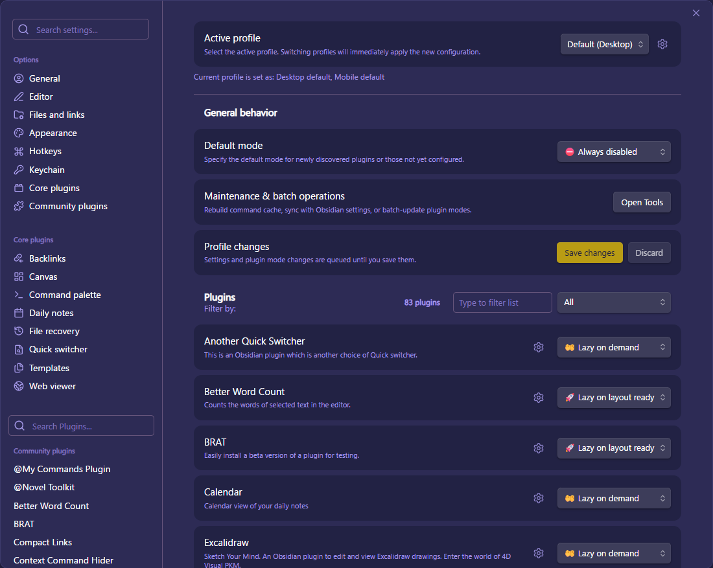
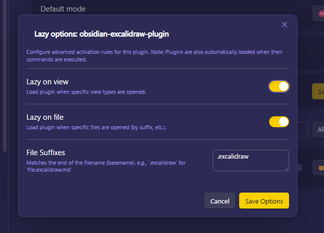

# On-Demand Plugins

Obsidian plugin that delays plugin activation and only loads plugins when needed, improving startup performance.

---

## How to use

1. Open **Settings → On-Demand Plugins**.
2. Choose a loading mode for each plugin.
3. Click **Apply changes** (Obsidian will restart automatically).

---

## Loading modes

| Mode                     | Description                                                                                                                                                                                                                                                                                        |
| ------------------------ | -------------------------------------------------------------------------------------------------------------------------------------------------------------------------------------------------------------------------------------------------------------------------------------------------- |
| **Lazy on demand**       | Loads when a command is executed, a specified view type is opened, or when a specific file is opened. In the settings modal you can separately enable `lazy on file` and `lazy on view`. View types are automatically collected when you click **Apply changes**, so manual entry is not required. |
| **Lazy on layout ready** | Loads after the workspace layout is ready.                                                                                                                                                                                                                                                         |
| **Always enabled**       | Loads at startup as normal.                                                                                                                                                                                                                                                                        |
| **Always disabled**      | Keeps the plugin disabled.                                                                                                                                                                                                                                                                         |

> When **Lazy on demand** is selected you can configure `lazy on file` and `lazy on view` individually in the modal. View types are auto-detected on **Apply changes**.

---

## Notes

- Plugins that use `setInterval` / `setTimeout` or register global hooks (for example, `vault.on`) should be set to **Lazy on layout ready**. If set to **Lazy on demand**, such plugins will not run their background tasks or hooks until they are loaded.
- Inline/embedded views (for example, Dataview inline queries) are not supported.

### Backups

When settings change, `.obsidian/community-plugins.json` is updated automatically. Up to three generations of backups are created; please keep your own backups as well.

### How it works

Instead of loading the plugin code at startup, this project registers "dummy commands" that cache command metadata. The actual plugin is loaded only when its command or a configured view/file is used. Internally it monkey-patches parts of Obsidian's core, so updates to Obsidian may break behavior.

---

This project is based on the work by Alan Grainger: https://github.com/alangrainger/obsidian-lazy-plugins

## Screenshots

<!-- Screenshot: On-Demand Plugins settings -->

*On‑Demand Plugins settings page.*

<!-- Screenshot: On-Demand Modal -->

*Settings modal.*
