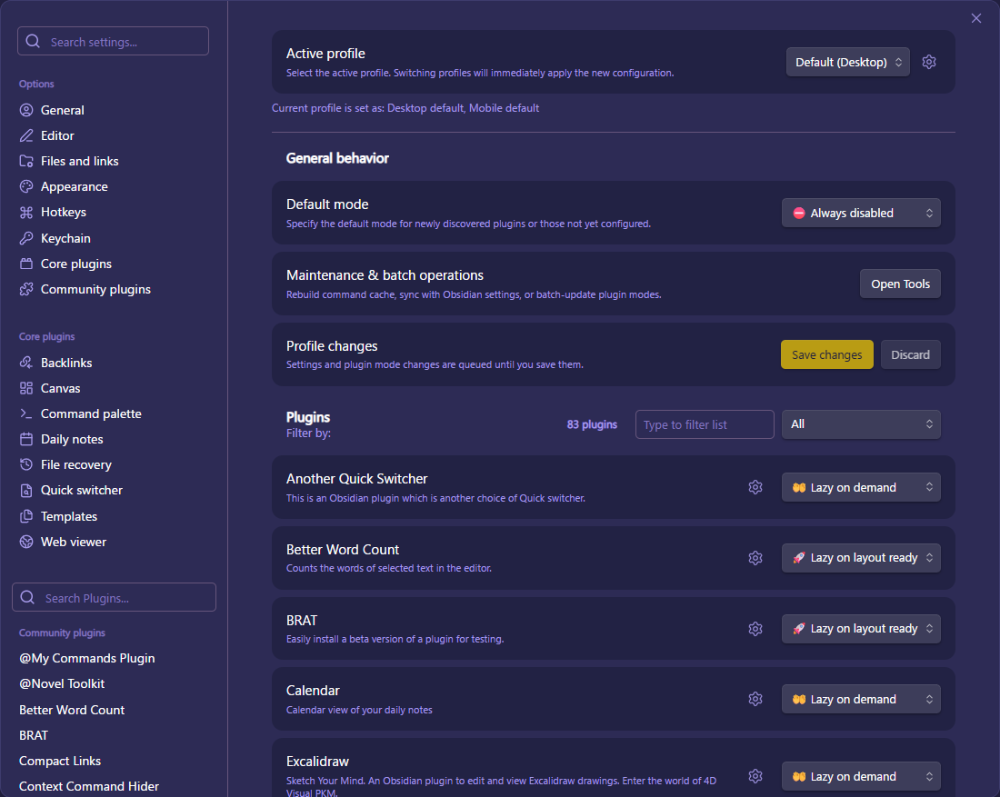

# 🦥 Lazy Loader（日本語）

プラグインのコマンドをキャッシュして遅延読み込みします。コマンドが実行されるか、指定したビューが開かれたときにプラグインを有効化することで、起動を高速化します。

**重要な注意 #1**: **Apply changes** をクリックした後、速度向上を適用するために Obsidian が一度再起動されます。これはプラグインの読み込みモードを変更した際にのみ必要です。

**重要な注意 #2**: このプラグインは、ユーザーが手動でプラグインを無効化／有効化したことを検出することはできません。プラグインを無効の状態で再起動後も保持したい場合は、Obsidian の標準プラグインページで操作せず、このプラグインの設定画面内で無効にしてください。

## ✅ 使い方

1. **設定 → On‑Demand Plugins** を開きます。
2. プラグイン一覧で各プラグインの動作モードを選びます：
   - **Lazy on command**: プラグインのコマンドを実行したときに読み込まれます。
   - **Lazy on view**: 指定したビューが開かれたときに読み込まれます。
   - **Lazy on layoutready**: レイアウトの準備が整った（layout-ready）時点で読み込まれます。
   - **Always enabled**: 起動時に通常通り読み込まれます。
   - **Disabled**: プラグインをオフのままにします。
3. **Apply changes** をクリックします。**Obsidian が自動的に再起動され**、選択した設定が適用されます。

## ✨ 機能と仕組み

### 仕組み
このプラグインは、起動速度を劇的に向上させるために以下の処理を行います：
- 設定したプラグインのコマンド情報をキャッシュし、本体の代わりに「ダミーのコマンド」を登録します。
- 起動時には本体の読み込みをスキップするため、Obsidian の起動が速くなります。
- キャッシュされたコマンドや特定のビューが呼び出された瞬間に、初めて対象のプラグインを正規のパッチを通してロードします。
- 安定して動作させるために、一括設定の適用時に `.obsidian/community-plugins.json` を直接書き換えます。

### 主な機能
- **コマンドベースの読み込み**: プラグインはそのコマンドを実行したときだけ読み込まれます。
- **ビュー起点の読み込み**: 指定したビュータイプが表示されたときにプラグインを自動で読み込みます。
- **ビュータイプの自動検出**: プラグインを **Lazy on view** に設定すると、Apply changes 時にビュータイプが自動的に取得されます。手動で指定する必要はありません。
- **カスタマイズ可能な起動ポリシー**: 各プラグインの読み込み方法を個別に設定できます。

## 📷 スクリーンショット

<!-- Screenshot: On-Demand Plugins settings -->

*On‑Demand Plugins 設定ページのスクリーンショット.*

## ⚠️ 推奨使用法と警告

### 重要: `community-plugins.json` のバックアップ
このプラグインはプラグインを一括で切り替える際に、Vault 内の `.obsidian/community-plugins.json` を直接書き換えることがあります。使用する前に `community-plugins.json` のバックアップを必ず取得してください。万が一に備えてコピーを別名で保存することを推奨します。

### モンキーパッチによる機能修正
このプラグインは Obsidian の内部機能をモンキーパッチ（直接書き換え）して動作しています。そのため、Obsidian の今後のアップデートによって動作が不安定になったり、機能が壊れたりする可能性があります。利用の際はその点をご了承ください。

### 適用範囲について
設定 `Re-register lazy commands on disable` は、`Lazy on command`（コマンド起点の遅延読み込み）だけでなく、`Lazy on view`（ビュー起点の遅延読み込み）にも適用されます。手動でプラグインを無効化した場合でも、キャッシュされているコマンドラッパーを再登録してコマンドを利用可能にします。

補足: Dataview のような埋め込み（インライン）ビューには対応していません。埋め込みビューは期待通りに遅延読み込みをトリガーしない可能性があります。

### 定期実行やフックを使用するプラグイン
以下を利用するプラグインは遅延読み込みに向きません：
- **定期的な処理**: `setInterval` や `setTimeout` によるバックグラウンド同期、定期タスク
- **グローバルイベントのフック**: 起動時に `this.app.vault.on('modify', ...)` や `this.app.workspace.on('layout-change', ...)` のようなイベント登録を行うプラグイン

これらのプラグインはトリガーされるまで有効化されないため、バックグラウンド処理やフックが期待通りに動かない可能性があります。

## 🙏 謝辞

- **Obsidian チーム**: 柔軟で強力なプラットフォームの提供に感謝します。
- **原案・基盤**: このプロジェクトは [Alan Grainger](https://github.com/alangrainger/obsidian-lazy-plugins) さんのオリジナルに触発され、フォークして発展させたものです。
